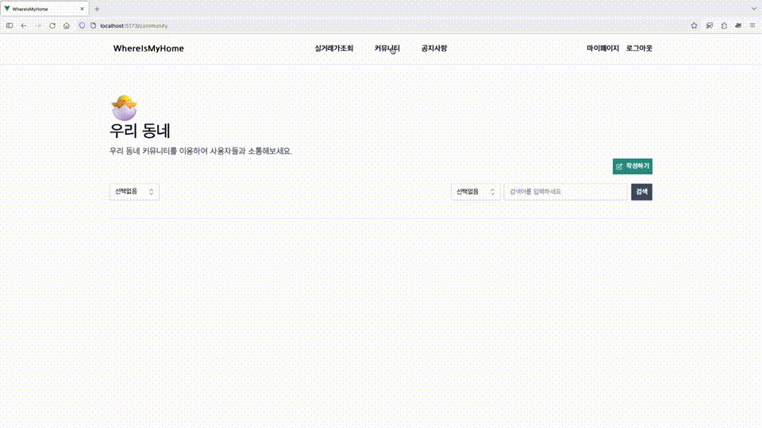
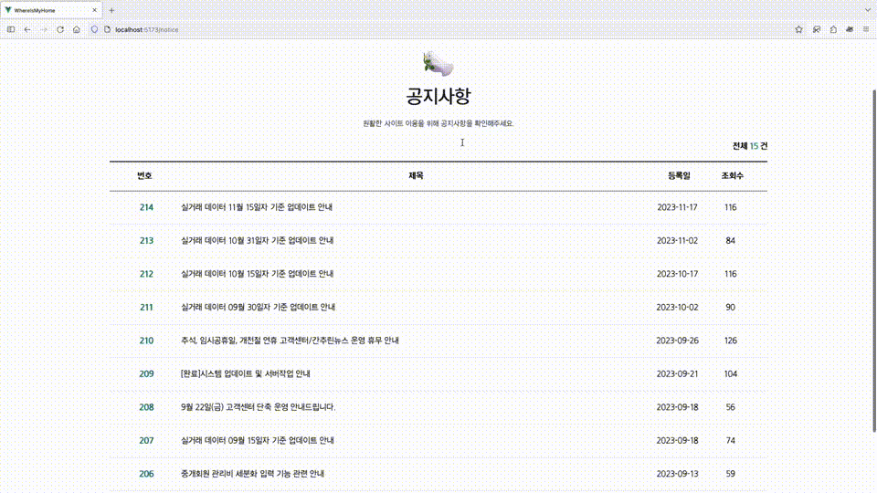
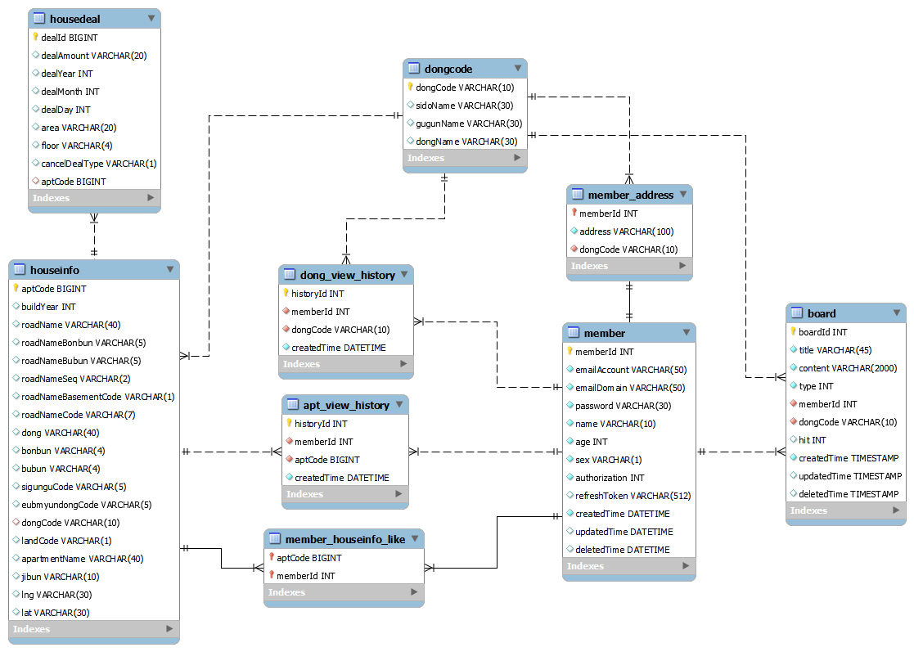

# WhereIsMyHome-Final

## 📚 페이지별 실행 화면

### 1. 메인화면


### 2. 실거래가 조회


### 3. 커뮤니티



### 4. 공지사항



---

## 🔍 실행 방법

### Dependencies

|  Name   | Version  |                     Link                     |
|:-------:|:--------:|:--------------------------------------------:|
| Node.js | ^18.17.1 |            https://nodejs.org/en             |
|  Java   |   1.8    | https://adoptium.net/en-GB/temurin/releases/ |
|  Maven  |   3.9    |    https://maven.apache.org/download.cgi     |
|  MySQL  |  8.0.34  |    https://dev.mysql.com/downloads/mysql/    |

### Database Setup

1. MySQL 8.0.34 버전 설치 확인.
2. MySQL Workbench 실행, DB 연결 후 `01.schema.sql`, `02.data.sql`, `*.20220315_aptcrawl.*.sql` 파일 순서대로 실행.

### Run locally

1. 프로젝트 클론 후 디렉토리로 이동

   ```bash
   git clone https://github.com/cheesecat47/whereismyhome-final.git
   cd whereismyhome-final
   ```

2. API 서버 실행

    1. `backend` 디렉토리로 이동

       ```bash
       cd backend
       ```

    2. `.env` 파일의 환경 변수 확인

       ```yaml
       SERVER_PORT=YOUR_SERVER_PORT
 
       DB_HOST=YOUR_DB_HOST
       DB_PORT=YOUR_DB_PORT
       DB_SCHEMA=YOUR_DB_NAME
       DB_USER=YOUR_USER
       DB_PASSWORD=YOUR_PASSWORD
 
       JWT_SALT=YOUR_SECRET
       ```

    3. 실행

       ```bash
       # 환경변수 적용
       set -a; source .env; set +a
 
       # Maven 패키징
       ./mvnw package
 
       # 실행
       java -jar target/whereismyhome_gumi_sjy_lsh-0.0.1-SNAPSHOT.jar
       ```

    4. IDE에서 실행 시 참고

        - 이클립스 환경 변수 등록 <https://proni.tistory.com/127>

3. Frontend 개발 서버 실행

   ```bash
   cd frontend
   npm i
   npm run dev
   ```

---

## 🖥 Entity Relation Diagram (ERD)



---

## 🐢 팀원 소개

|  |  |
|:------------------------------------------------------:|:----------------------------------------------------------:|
|           [이승현](https://github.com/hyun812)            |           [신주용](https://github.com/cheesecat47)            |
